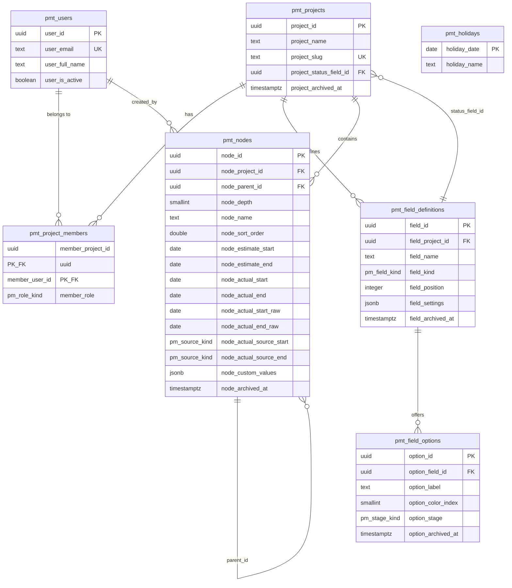

# 02 — Data model

Executable DDL lives in [`../../db/schema.sql`](../../db/schema.sql). This document explains *why* the schema is shaped that way, and records the decisions a future reader would otherwise re-litigate.

---

## 1. Entity relationships



## 1b. Column naming convention

Every column carries its own table's entity prefix — `pmt_users.user_id`, `pmt_nodes.node_name`, `pmt_field_options.option_label`. Two consequences worth stating:

- **A column name is unambiguous in any join.** No aliasing is needed to read a query, and `node_project_id = project_id` says which side is which without looking at the FROM clause.
- **No identifier is an SQL reserved word.** Bare `id`, `name`, `type`, `level`, `position`, `role`, `label`, `date`, `end`, `start`, `user`, `order` and `config` appear nowhere in the schema. Where a natural name was reserved, the prefix did not resolve it alone and the word itself was changed: `level` → `node_depth`, `type` → `field_kind`, `config` → `field_settings`.

Enum type names take a `_kind` suffix for the same reason: `pm_role_kind`, `pm_field_kind`, `pm_stage_kind`, `pm_source_kind`.

Function and procedure parameters are prefixed `p_`; `plpgsql` locals `v_`. Set-returning functions prefix their output columns (`descendant_*`, `rollup_*`, `misclosure_*`, `led_*`) so nothing in a function body can collide with a table column of the same name — a real hazard in `pmf_project_ledger`, which selects from `pmt_nodes` while returning similarly-shaped columns.

`pmt_holidays` stands alone — one installation serves one organisation, so the calendar is global. If the product ever hosts multiple organisations, this table gains a tenant column and nothing else changes.

---

## 2. The seven decisions this schema encodes

### 2.1 One node table, not four

`project`, `module`, `task`, `subtask` are the same shape: a name, four dates, custom values, a parent. Four tables would mean four sets of date columns, four roll-up implementations, and four query paths for one List view.

`node_depth` is a discriminator, and the `CHECK` allows `1..6`. The ceiling is the application constant `MAX_DEPTH`, which started at 4 and moved to 6 on 2026-09-07 — a one-line change with no migration, which is exactly the escape hatch this shape was chosen to preserve.

`node_project_id` is denormalised onto every node. Without it, loading a list means walking to the root to discover which project's field definitions apply. With it, every query is flat.

### 2.2 Four date columns, not two plus a history table

An audit table would technically record both plan and reality. It would also make "show me the estimate" a query over a log, which means the timeline could not draw estimate bars without reconstructing state. The whole product is that comparison; it belongs in columns.

The four columns have **no database object that writes one from another** — no triggers, no generated columns, no defaults referencing siblings. That is the enforcement of domain rule D-10.

### 2.3 Raw actual columns

`node_actual_start_raw` / `node_actual_end_raw` cost two nullable date columns and buy back everything forward-snapping destroys. They are written once at capture and never updated.

This is the mitigation for a known trade-off: snapping both endpoints forward means a weekend-only task reads as a single Monday. The raw columns hold what really happened, so the snap is a presentation convention rather than data loss, and the decision stays reversible.

### 2.4 `node_actual_source_*` is a rendering token, not just metadata

`auto` renders blue-black (system-derived), `manual` renders graphite (human-entered) — DESIGN.md § Colors rule 2. The colour is the audit trail, visible without opening anything. It is also the guard for D-14: once `manual`, automatic capture never touches that field again.

### 2.5 `jsonb` for values, real tables for definitions

Definitions and options are relational because they are few, are edited through a UI, and need ordering and archival. Values are `jsonb` because the dominant read is *"every node in this list with every column"* — 100 nodes × 9 fields is 100 rows from `jsonb` and 900 rows from an EAV table needing a pivot.

The `jsonb_path_ops` GIN index makes filtering and sorting by field id fast enough at this scale.

**What is given up:** referential integrity between values and options. There is no foreign key, so nothing stops a stored option id from pointing at a deleted option. The replacement guarantees are behavioural:

- options archive, never delete (D-33)
- definitions archive, never delete (D-34)
- type changes are forbidden (D-31)
- writing an unknown field key is rejected at the API boundary (`E_UNKNOWN_FIELD`)

Those four rules are the only thing standing between this design and orphaned data, so none of them is negotiable.

### 2.6 No triggers, anywhere

The tempting design is a trigger that maintains parent dates when a child changes. It was rejected:

- Timeline drag moves several bars in one gesture; cascading triggers up a six-level tree invite lock contention and deadlocks.
- A trigger that writes parent dates from children *is* the overwrite this product exists to prevent (D-21).
- Trigger-borne logic is hard to test and invisible at the call site.

Instead, roll-up is computed on read by `pmf_project_ledger`. Nothing is stored, so nothing can drift.

### 2.7 Functions compute, TypeScript decides

The split follows the rule set in the requirements interview:

| In PostgreSQL (`pmf_`) | In TypeScript |
|---|---|
| Working-day arithmetic over the holiday table | Depth ceiling (D-2) |
| Recursive descendant walks | Level validation on move (D-3) |
| Roll-up aggregation | Automatic actual capture (D-13, D-14) |
| Misclosure figures | Snapping orchestration (D-15) |
| The whole-project ledger read | Custom value validation (D-32) |
| Subtree archive / restore / move (`pmp_`) | Permission checks |

The dividing line: anything that sweeps many rows runs in the database; anything that decides what is allowed runs in TypeScript where it can be unit tested.

---

## 3. The one query that matters

`pmf_project_ledger(project_id)` returns one row per node carrying its own dates, durations, misclosure, and its descendants' roll-up. Both views read it.

It builds a transitive-closure CTE of ancestor/descendant pairs once, aggregates over it once, and joins back — rather than calling `pmf_rollup` per node, which would re-walk the tree N times. At the stated scale (under 1,000 nodes) it is a single fast query; the shape also holds if the scale assumption turns out wrong.

Read path:

```
GET /api/projects/:id/ledger
  → pmf_project_ledger(:id)
  → resolve custom_values keys against pmt_field_definitions + pmt_field_options
  → nest into a tree by parent_id in TypeScript
  → return
```

Field definitions and options are fetched separately and cached per project. They change rarely; nodes change constantly.

---

## 4. Write paths

| Action | Steps |
|---|---|
| Edit a cell | validate key against definitions → `jsonb_set` on `node_custom_values` → if the key is the project's status field, run automatic actual capture (D-13) in the same transaction |
| Edit an estimate date | validate `start <= end` → write. Never touches actuals. |
| Edit an actual date | validate → `raw := value` → `value := pmf_next_workday(value)` → set `actual_source_* = 'manual'` → write. Never touches estimates. |
| Drag a timeline bar | same as the corresponding date edit; an actual drag is a manual edit by definition (D-14) |
| Create a node | resolve `node_depth` from parent → reject if parent is at the ceiling → insert with `node_sort_order` between neighbours |
| Move a node | validate target is `level - 1` → `CALL pmp_move_subtree(...)` |
| Delete a node | `CALL pmp_archive_subtree(...)`. Admin only. |
| Archive a field | set `field_archived_at`. Values remain in `jsonb`. |

Every write returns the node's freshly computed ledger row so the grid updates without a refetch.

---

## 5. Indexes and why each exists

| Index | Serves |
|---|---|
| `pmt_nodes_project_idx (node_project_id, node_depth, node_sort_order)` | the ledger read and list ordering |
| `pmt_nodes_parent_idx (node_parent_id)` | the recursive descendant walk |
| `pmt_nodes_dates_idx (node_project_id, node_estimate_start, node_estimate_end)` | timeline windowing by visible date range |
| `pmt_nodes_custom_gin (node_custom_values jsonb_path_ops)` | filtering and grouping by a custom field |
| `pmt_field_definitions_project_idx` | loading a project's column set |
| `pmt_project_members_user_idx` | "which projects can this user see" |

All the node indexes are partial on `node_archived_at IS NULL`, since archived rows are never read by either view.

---

## 6. What is deliberately absent

| Absent | Why |
|---|---|
| A dependencies table | Out of scope. Adding it later needs a new table and a cycle guard, and touches nothing here. |
| An audit/history table | Not required by any phase-one feature. `node_actual_source_*` and the raw columns cover the one history question that matters. |
| Stored roll-up columns | They would drift, and maintaining them requires the triggers this design refuses. |
| A tenant/workspace table | One installation, one organisation. |
| A `views` / saved-filter table | No saved filters in phase one. |
| Session and credential tables | Owned by the auth library. |
| Per-level field sets | Fields apply to every level of their project. |
